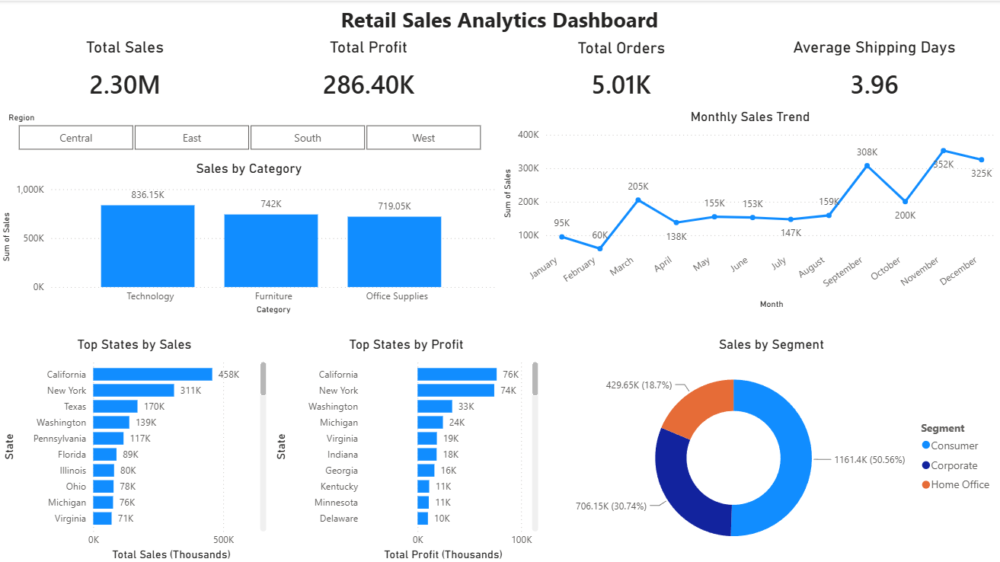
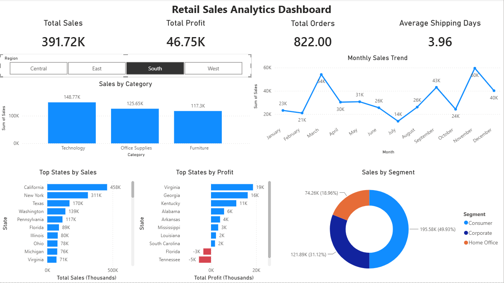
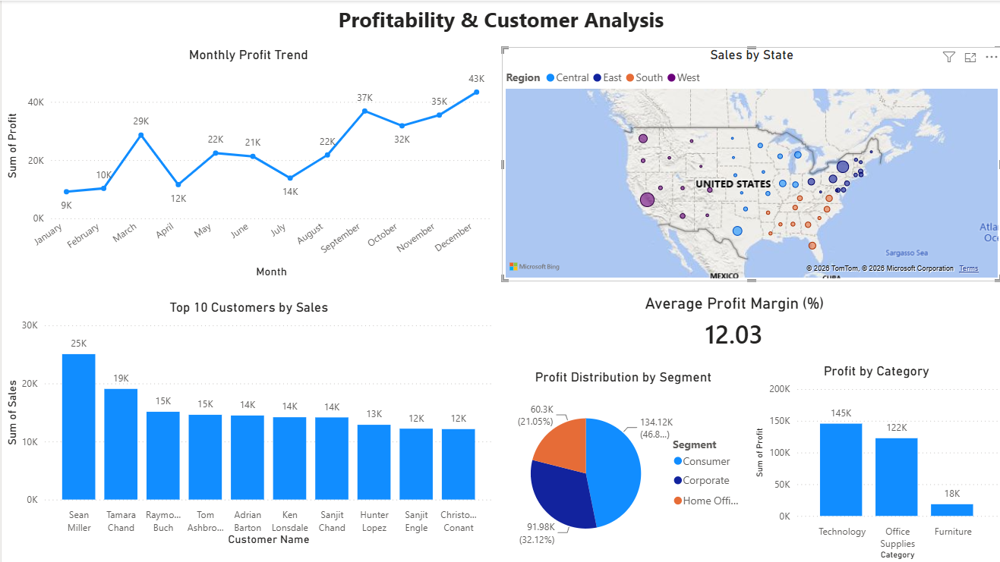
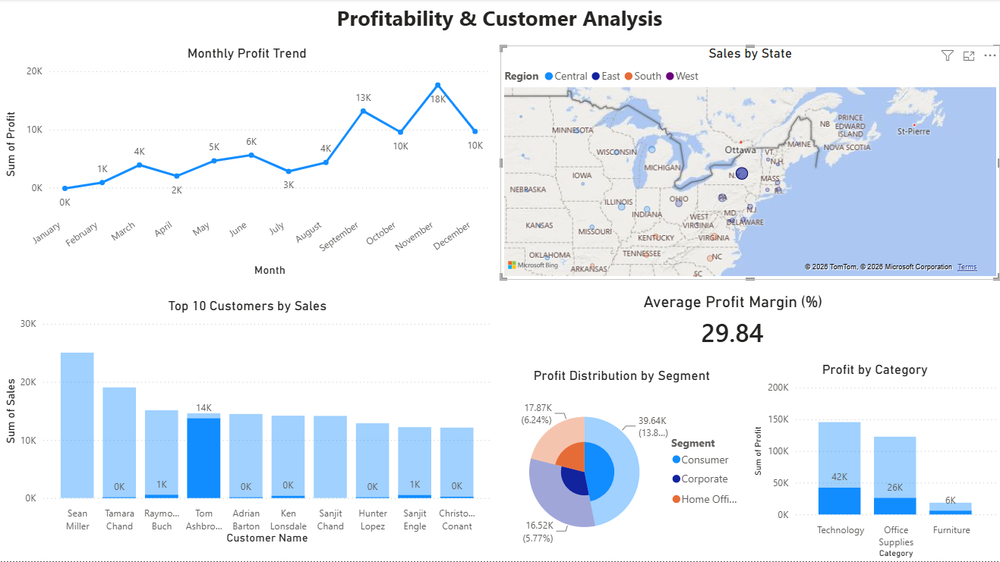

## **Retail Sales Analytics Dashboard** 
   

### **Project Overview**


This project analyzes retail sales performance using PostgreSQL, VS Code Python, and Power BI. *This repo contains all raw files for this project.*


The dataset was cleaned and transformed using Python, loaded into PostgreSQL for querying, and visualized in Power BI through an interactive dashboard.


The dashboard provides insights into:


* Total Sales
* Total Profit
* Order Volume
* Average Shipping Time
* Monthly Sales Trends
* Top Performing States
* Product Category Performance
* Customer Profitability
* Segment Analysis


### **Dashboard Screenshots**

Retail Sales Overview





Profitability \& Customer Analysis





##### **Tools Used**


###### **PostgreSQL**


Used for data storage, SQL querying, and aggregation.


###### **VS Code, Python**


Used for:

* Data cleaning
* Data transformation
* Loading data into PostgreSQL


###### **Power BI**


Used to create interactive dashboards and business insights.


##### **Project Workflow**


**1. Data Cleaning \& Transformation**


Python scripts were used to:


Clean raw retail data

Create calculated columns

Prepare data for database loading


Files:


transform\_sales\_data.py

load\_to\_postgres.py


**2. Database Analysis**


SQL queries were written to:


* Calculate total sales
* Calculate total profit
* Aggregate sales by state
* Create reusable database views


File:


queries.sql


Example:


```
CREATE VIEW sales_by_state AS
SELECT
    "State",
    ROUND(SUM("Sales")::numeric, 2) AS total_sales,
    ROUND(SUM("Profit")::numeric, 2) AS total_profit
FROM sales
GROUP BY "State";
```


**3. Power BI Dashboard**


The Power BI dashboard contains two pages:


**Page 1 — Retail Sales Overview**


Features:


* Total Sales KPI
* Total Profit KPI
* Order Count KPI
* Average Shipping Days KPI
* Monthly Sales Trend
* Top States by Sales
* Top States by Profit
* Sales by Category
* Sales by Segment
* Region Filter


**Page 2 — Profitability \& Customer Analysis**


Features:


* Average Profit Margin KPI
* Monthly Profit Trend
* Profit by Segment
* Profit by Category
* Top Customers by Sales


### **Key Insights**


Sales Performance

* Total Sales exceeded $2.3M
* California generated the highest sales
* Consumer Segment contributed the largest share of revenue

Profitability

* Total Profit exceeded $286K
* Technology products generated the highest profit
* Profit increased steadily across the analyzed period

Customers

* A small group of customers generated a significant portion of sales
* Top customers contributed substantially more revenue than the average customer

